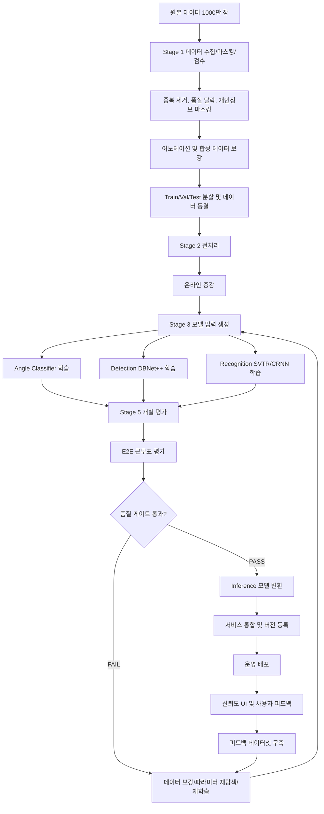
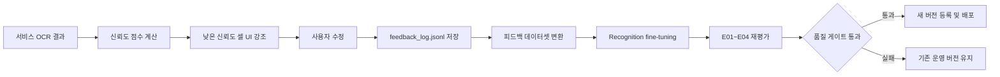

# OCR 개발 프로젝트 스캐폴드

이 워크스페이스는 전달받은 OCR 흐름도를 기준으로 구성한 프로젝트 뼈대입니다.  
한국어 근무표 OCR 파이프라인을 단계별로 개발할 수 있도록 데이터 수집, 전처리, 모델 설계, 학습, 평가, 배포 영역을 나누어 정리했습니다.

## 단계 구성

1. `stage1_data`: 데이터 수집 기준, 합성 데이터 생성, 어노테이션 가이드, 데이터셋 분할/검수
2. `stage2_preprocess`: 이미지 전처리, 데이터 증강, 한국어 문자 사전
3. `stage3_models`: Detection, Recognition, Angle Classifier, 전이학습 전략
4. `stage4_training`: 학습 환경, loss/optimizer, 하이퍼파라미터, 모니터링
5. `stage5_evaluation`: Detection 평가, Recognition 평가, E2E 평가, 품질 게이트
6. `stage6_deployment`: 모델 export, 서비스 통합, 신뢰도 UI, 버전 관리

## 실행 시작점

현재 스캐폴드 요약은 아래 명령으로 확인할 수 있습니다.

```bash
python -m ocr_project.main
```

## 빠른 설치

### 공통 실행용 최소 라이브러리

프로젝트 초기 구조 확인과 로컬 유틸리티 실행에 필요한 최소 패키지입니다.

```bash
pip install numpy opencv-python pyyaml pillow
```

### OCR 학습용 전체 환경

Detection, Recognition, Angle Classifier 학습까지 포함한 전체 학습 스택은 아래처럼 설치합니다.

```bash
pip install -r requirements_train.txt
```

`requirements_train.txt`를 쓰지 않고 한 번에 직접 설치하려면:

```bash
pip install paddleocr==2.8.0 opencv-python==4.9.0.80 albumentations==1.4.0 wandb==0.16.0 pyyaml==6.0.1 tqdm==4.66.0 matplotlib==3.8.0 scikit-learn==1.4.0 shapely==2.0.3 lmdb==1.4.1
```

### PaddlePaddle 설치

학습 전에 환경에 맞는 PaddlePaddle을 별도로 설치해야 합니다.

GPU 환경 예시:

```bash
python -m pip install paddlepaddle-gpu==2.6.0 -i https://www.paddlepaddle.org.cn/packages/stable/cu117/
```

CPU 환경 예시:

```bash
python -m pip install paddlepaddle==2.6.0 -i https://www.paddlepaddle.org.cn/packages/stable/cpu/
```

### 한 번에 세팅하는 예시

새 학습 환경을 가장 빠르게 만드는 기본 순서는 아래와 같습니다.

```bash
python -m venv .venv_train
.venv_train\Scripts\activate
python -m pip install --upgrade pip
python -m pip install paddlepaddle-gpu==2.6.0 -i https://www.paddlepaddle.org.cn/packages/stable/cu117/
pip install -r requirements_train.txt
```

## 핵심 개념

이 프로젝트는 단일 OCR 모델 하나가 아니라, 근무표 이미지를 안정적으로 읽기 위한 전체 OCR 파이프라인입니다.

### 1. Detection과 Recognition의 차이

- Detection은 이미지 안에서 텍스트가 어디에 있는지 찾습니다.
- Recognition은 Detection이 잘라낸 텍스트 영역을 실제 문자열로 읽습니다.
- Detection이 놓친 텍스트는 Recognition이 아무리 좋아도 읽을 수 없습니다.

이 프로젝트에서의 기본 선택은 다음과 같습니다.

- Detection 모델: `DBNet++`
- Recognition 모델: `SVTR-Tiny`
- Recognition 대안 모델: `CRNN`
- Angle Classifier: `MobileNetV3-Small`

### 2. 전처리가 중요한 이유

실제 근무표 이미지는 항상 깔끔하지 않습니다.

- 스마트폰 촬영본은 기울어져 있을 수 있습니다.
- 스캔본은 대비가 낮을 수 있습니다.
- 화면 캡처는 압축 열화가 있을 수 있습니다.
- 손글씨와 인쇄 텍스트가 섞일 수 있습니다.

그래서 학습과 추론 전에 입력을 가능한 한 표준 형태로 맞춰야 합니다.  
이 프로젝트의 전처리 파이프라인은 아래 단계를 중심으로 설계되어 있습니다.

- 이미지 로드 및 포맷 정규화
- 방향 보정
- 노이즈 제거 및 선명화
- 기울기 보정
- 리사이즈 및 픽셀 정규화

### 3. 증강이 중요한 이유

실제 데이터는 항상 부족하고, 특정 포맷이나 업종에 치우치기 쉽습니다.  
증강은 데이터를 더 다양하게 만들어 모델이 실제 서비스 입력에 강해지도록 돕습니다.

- Detection 증강은 전체 이미지와 바운딩박스를 함께 바꿉니다.
- Recognition 증강은 잘린 crop 이미지에 더 약한 변형을 적용합니다.
- Angle Classifier 증강은 라벨 의미가 바뀌지 않도록 회전 계열 변형을 조심해서 다룹니다.

### 4. 문자 사전의 역할

Recognition 모델은 아무 글자나 출력하는 것이 아닙니다.  
문자 사전에 있는 글자만 예측할 수 있습니다.

- 현대 한글 완성형
- 영문 대문자/소문자
- 숫자
- 근무표 특화 기호
- `<unk>`, `<pad>`, `<blank>` 같은 특수 토큰

만약 실제 근무표에 등장하는 기호가 사전에 없으면, 모델은 그 글자를 정확히 출력할 수 없습니다.

### 5. 왜 단계별 파이프라인으로 나누는가

이 프로젝트는 흐름도 기반의 단계형 구조를 따릅니다. 이유는 각 단계 결과가 다음 단계 품질을 직접 결정하기 때문입니다.

1. 데이터 수집 및 마스킹
2. 합성 데이터 생성
3. 어노테이션
4. 데이터셋 분할 및 품질 검수
5. 전처리 및 증강
6. 모델 설계
7. 학습 환경 및 학습 설정
8. 평가
9. 배포

이렇게 나누면 문제 원인을 추적하기 쉬워집니다.  
예를 들어 Recognition 성능이 낮아 보여도 실제 원인은 잘못된 crop, 누락된 문자 사전, 부정확한 라벨일 수 있습니다.

## 주요 기술 스택

### PaddlePaddle / PaddleOCR

- `PaddlePaddle`은 이 프로젝트의 딥러닝 학습/추론 프레임워크입니다.
- `PaddleOCR`은 DBNet++, SVTR, MobileNetV3 같은 OCR 관련 기준 구현을 제공합니다.
- 이 프로젝트는 PaddleOCR 생태계 위에서 커스텀 구조를 쌓는 방향으로 설계되어 있습니다.

### OpenCV

OpenCV는 다음 작업에 사용됩니다.

- 이미지 로드
- 리사이즈
- 노이즈 제거
- 블러 및 샤프닝
- 기하학적 변환
- 시각화와 박스 드로잉

### NumPy

NumPy는 다음 작업에 사용됩니다.

- 이미지 배열 처리
- 맵 생성
- 정규화
- 배치 패딩 및 텐서 변환

### YAML 설정 파일

주요 동작은 코드 하드코딩보다 YAML 설정으로 제어합니다.

- 모델 설정
- 전처리 설정
- 증강 설정
- 학습 설정

이 방식은 실험 재현성과 설정 비교에 유리합니다.

### LMDB

LMDB는 대용량 OCR 데이터에서 선택적으로 사용하는 I/O 최적화 수단입니다.

- crop 파일이 많아질수록 파일 시스템 병목을 줄일 수 있습니다.
- Recognition 학습에서 특히 효과적일 수 있습니다.
- 처음부터 필수는 아니고, DataLoader가 병목일 때 도입하면 됩니다.

### pretrained weight와 checkpoint의 차이

둘은 비슷해 보이지만 역할이 다릅니다.

- pretrained weight: 사전학습된 초기 가중치
- checkpoint: 내 학습 과정 중 저장한 진행 상태

pretrained weight는 좋은 초기값을 주고, checkpoint는 학습 중단 후 이어서 학습하거나 최고 성능 모델을 보존하는 데 필요합니다.

## 미리 알면 좋은 배경지식

이 저장소를 편하게 다루려면 아래 개념을 알고 있으면 좋습니다.

- Python 패키징과 가상환경
- OpenCV 기반 기본 컴퓨터 비전 처리
- supervised learning 데이터셋 구성과 train/val/test 분할
- OCR에서의 Detection / Recognition 구분
- CTC 디코딩 기초
- GPU 메모리, 배치 크기, mixed precision
- YAML 기반 실험 설정 관리

전부 미리 알고 시작할 필요는 없지만, 이 개념들이 있으면 학습과 디버깅 흐름을 훨씬 빨리 이해할 수 있습니다.

## 현재 구현 범위

### OCR-D01 데이터 수집 기준

`stage1_data/collection_spec.py`에는 근무표 원본 수집 목표, 품질 기준, 개인정보 처리 규칙, 폴더 구조 기준이 들어 있습니다.

`stage1_data/collection_workflow.py`는 아래 기능을 제공합니다.

- `data/raw`, `data/masked`, `data/rejected`, `data/meta` 초기화
- 명명 규칙에 맞는 파일명 생성 및 검증
- 이미지 품질 합격/탈락 판정
- `collection_log.csv`, `quality_check.csv` 기록 보조

### OCR-D02 합성 데이터 생성

`stage1_data/synthetic_generator.py`는 아래 기능을 제공합니다.

- `data/synthetic/render`, `data/synthetic/aug`, `data/synthetic/labels` 구조 초기화
- 렌더링/증강 결과용 파일명 생성
- 기본 폰트/사전/노이즈 설정
- 랜덤 시드 기반 `synth_params.json` 재현 가능 설정
- 생성 수량 점검 및 로그 기록 보조

### OCR-D03 어노테이션 가이드

`stage1_data/annotation_guide.py`와 `stage1_data/annotation_workflow.py`는 아래 기능을 제공합니다.

- PPOCRLabel 중심 도구 추천
- bbox 및 텍스트 입력 규칙
- `data/labels` 작업공간 초기화
- PaddleOCR `det_gt.txt`, `rec_gt.txt` 포맷 생성 보조
- IoU 기반 캘리브레이션 점검

### OCR-D04 데이터셋 분할 및 검수

`stage1_data/dataset_splitter.py`는 아래 기능을 제공합니다.

- masked / synthetic / labels 결과물 선행조건 확인
- 자동 품질 점검
- 계층적 train/val/test 분할
- 데이터 누수 및 difficult 제외 규칙 검증
- `split_config.json`, `dataset_stats.json`, `quality_report.md` 생성 보조

### OCR-P01 전처리 모듈

`stage2_preprocess/preprocess.py`는 아래 기능을 제공합니다.

- 학습/추론 공용 `PreprocessPipeline`
- 로드, 방향 보정, 노이즈 제거, deskew, resize, normalize 단계 제어
- Detection/Recognition 별 입력 규격 처리
- 시각화 결과 저장

### OCR-P02 온라인 증강

`stage2_preprocess/augmentation.py`는 아래 기능을 제공합니다.

- 학습 전용 `AugmentPipeline`
- Detection용 기하/광학 변환과 bbox 동기화
- Recognition용 `single_char`, `date`, `handwrite`, `normal` 증강 분기
- 배치 처리와 시각화 보조

### OCR-P03 한국어 문자 사전

`stage2_preprocess/korean_charset.py`는 아래 기능을 제공합니다.

- `rec_gt.txt` 기반 문자 추출
- PaddleOCR 호환 문자 사전 생성
- 메타 정보 및 빈도 통계 파일 작성
- 커버리지, 중복, UTF-8, `<blank>` 위치 검증

### OCR-M01 Detection 모델

`stage3_models/detection_model.py`와 `backend/ocr/models/det/`는 아래 기능을 제공합니다.

- ResNet50 + FPNASF + DBHead 기반 DBNet++ 스펙
- `(1, 3, 960, 960) -> (1, 1, 240, 240)` 출력 shape 시뮬레이션
- freeze/unfreeze 전략 요약
- 후처리와 padding 역변환 보조

### OCR-M02 Recognition 모델

`stage3_models/recognition_model.py`와 `backend/ocr/models/rec/`는 아래 기능을 제공합니다.

- SVTR-Tiny 기본 스펙
- CRNN 대안 스펙
- CTC 디코더 구성
- `(4, 3, 32, 128) -> (4, 32, vocab_size)` shape 시뮬레이션

### OCR-M03 Angle Classifier

`stage3_models/angle_classifier.py`와 `backend/ocr/models/cls/`는 아래 기능을 제공합니다.

- MobileNetV3-Small 기반 0도/180도 분류기 스펙
- `data/angle/{train,val,test}/{0,1}` 데이터셋 구조 생성 보조
- 임계값 기반 회전 판단 규약
- `(1, 3, 48, 192) -> (1, 2)` shape 점검

### OCR-T01 학습 환경

`stage4_training/environment.py`, `requirements_train.txt`, `train/` 디렉토리는 아래 기능을 제공합니다.

- RTX 2080 Ti 11GB 기준 학습 기본값
- Detection / Recognition / Classifier용 학습 설정 파일
- DataLoader 초안, trainer 초안, 스크립트 초안
- checkpoint, log, weights, LMDB 변환 구조

### OCR-T03 학습 스케줄 및 하이퍼파라미터

`stage4_training/hyperparameters.py`, `train/configs/*_hyperparams_final.yaml`, `train/configs/hyperparam_search.yaml`, `experiments/` 디렉토리는 아래 기능을 제공합니다.

- Classifier / Detection / Recognition별 고정 하이퍼파라미터와 탐색 대상 분리
- RTX 2080 Ti 11GB 기준 첫 실행 추천값 기록
- Early stopping 기준과 재현성 seed 기준 정의
- 실험 결과 CSV 템플릿 생성
- 최종 확정 전 상태를 `provisional`로 관리

### OCR-T04 학습 모니터링 및 로깅

`stage4_training/monitoring.py`, `train/configs/monitoring_config.yaml`, `train/utils/*monitor*`, `train/utils/checkpoint.py`는 아래 기능을 제공합니다.

- wandb 프로젝트명 `shiftflow-ocr`와 모델별 로깅 항목 정의
- 로컬 `train_log.csv`, `val_log.csv`, `summary.txt` 생성 구조
- NaN loss, loss 발산, grad norm 폭증, val/train loss gap 감지
- `latest.pdparams`, `best.pdparams`, 최근 epoch checkpoint 3개 유지
- Slack webhook 기반 학습 완료 알림 메시지 생성
- Detection/Recognition 시각화 결과 저장을 위한 유틸리티

### OCR-E01 Detection 평가

`stage5_evaluation/detection_metrics.py`, `train/evaluators/det_evaluator.py`, `train/scripts/eval_det.py`는 아래 기능을 제공합니다.

- IoU 계산과 greedy 1:1 매칭
- difficult 박스 제외 규칙 반영
- Precision / Recall / F1 / TP / FP / FN 계산
- 이미지별 성능, 포맷별 성능, 업종별 성능 분석
- FP/FN 오류 유형 분석과 `error_analysis.md` 생성
- `summary.json`의 `target_met` 필드 생성
- TP/FP/FN 색상 구분 시각화 저장

### OCR-E02 Recognition 평가

`stage5_evaluation/recognition_metrics.py`, `train/evaluators/rec_evaluator.py`, `train/scripts/eval_rec.py`는 아래 기능을 제공합니다.

- 한글 문자 단위 Levenshtein 편집 거리 계산
- CER / WER / Accuracy / Normalized CER 계산
- `single_char`, `date`, `handwrite`, `normal` 타입별 성능 분석
- `###` 판독 불가 라벨 평가 제외
- 글자 혼동 쌍 `confusion_pairs.csv` 생성
- 길이별 오류율과 high-CER 샘플 분석
- 근무 코드 정확도와 날짜 완전 일치율 계산
- `summary.json`의 `all_targets_met` 필드 생성

## 학습 환경 기본값 메모

현재 사용자가 제공한 GPU 정보 기준으로 기본 학습값은 아래 방향으로 맞춰져 있습니다.

- GPU: `RTX 2080 Ti 11GB`
- 기본 precision: `fp16`
- 기본 사용 GPU: `gpu_ids: [0]`
- Classifier batch size: `128`
- Detection batch size: `12`
- Recognition batch size: `64`
- Classifier first-run learning rate: `0.001`
- Detection first-run learning rate: `0.001`
- Recognition first-run learning rate: `0.001`
- Early stopping: `Classifier patience 10`, `Detection patience 20`, `Recognition patience 15`

### OCR-E03 End-to-End 근무표 평가

`stage5_evaluation/e2e_metrics.py`, `train/evaluators/e2e_evaluator.py`, `train/scripts/eval_e2e.py`, `data/e2e_gt/`는 근무표 이미지 한 장을 최종 근무자 x 날짜 스케줄 매트릭스로 복원했을 때의 정확도를 평가합니다.

- `data/e2e_gt/*.json` 형식의 정답 매트릭스를 읽습니다.
- OCR 결과의 텍스트와 bbox를 y/x 좌표 기준으로 행과 열 클러스터링합니다.
- 날짜 헤더와 이름 열을 추정해 예측 스케줄 매트릭스를 생성합니다.
- Cell Accuracy, Worker Schedule Accuracy, Name Accuracy, Code Distribution Error를 계산합니다.
- 오류를 `det_miss`, `rec_error`, `parse_error`로 분류해 개선 대상을 추적합니다.
- `summary.json`, `per_image.csv`, `error_attribution.csv`, `format_breakdown.csv`, `industry_breakdown.csv`, `e2e_report.md`를 생성합니다.

실행 예시:

```bash
python train/scripts/eval_e2e.py \
  --gt_dir data/e2e_gt \
  --image_dir data/dataset/test/images \
  --ocr_results train/eval_results/e2e/ocr_results.json \
  --output_dir train/eval_results/e2e
```

### OCR-E04 품질 게이트

`stage5_evaluation/quality_gate.py`, `train/evaluators/quality_gate.py`, `train/scripts/quality_gate.py`는 E01~E03 평가 결과와 서비스 성능 지표를 종합해 모델 변환/서비스 통합 단계로 넘어갈 수 있는지 판정합니다.

- Gate 1: Detection, Recognition, Angle Classifier 개별 모델 기준을 확인합니다.
- Gate 2: E2E Cell Accuracy, Worker Schedule Accuracy, Name Accuracy, Code Distribution Error, 파싱 성공률을 확인합니다.
- Gate 3: CPU 추론 속도, 메모리, 안정성, 신뢰도 점수 유효성을 확인합니다.
- 최종 상태는 `PASS`, `FAIL`, `CONDITIONAL_PASS` 중 하나로 기록됩니다.
- `quality_report.md`, `deploy_manifest.json`, `gate_summary.json`을 생성합니다.

실행 예시:

```bash
python train/scripts/quality_gate.py \
  --det_result train/eval_results/det/summary.json \
  --rec_result train/eval_results/rec/summary.json \
  --cls_result train/checkpoints/cls/eval_summary.json \
  --e2e_result train/eval_results/e2e/summary.json \
  --service_result train/eval_results/service/summary.json \
  --output_dir train/quality_gate \
  --generate_report
```

### OCR-S01 Inference 모델 변환

`stage6_deployment/export_model.py`, `train/scripts/det_export.py`, `train/scripts/rec_export.py`, `train/scripts/cls_export.py`, `train/scripts/export_all.py`는 학습 완료 체크포인트를 Paddle Inference 배포 구조로 내보내기 위한 공통 인터페이스입니다.

- Detection 입력 스펙: `[None, 3, None, None]`
- Recognition 입력 스펙: `[None, 3, 32, None]`
- Angle Classifier 입력 스펙: `[None, 3, 48, 192]`
- Recognition export 시 `dict_latest.txt`를 inference 폴더의 `dict.txt`로 함께 복사합니다.
- 각 모델 폴더에 `model_info.json`을 생성해 source checkpoint, config, input spec, 성능 메타를 기록합니다.
- `build_predictor_config()`와 `build_predictor()`로 OCR-S02에서 사용할 Paddle Predictor 인터페이스를 제공합니다.
- 로컬 구조 검증용으로 `--dry_run`을 지원합니다. 실제 export는 Paddle 런타임과 실제 모델 builder가 있는 학습 서버에서 수행합니다.

실행 예시:

```bash
python train/scripts/det_export.py \
  --config train/configs/det_config.yaml \
  --checkpoint train/checkpoints/det/best.pdparams \
  --output_dir backend/ocr/inference/det

python train/scripts/rec_export.py \
  --config train/configs/rec_config.yaml \
  --checkpoint train/checkpoints/rec/best.pdparams \
  --dict_path backend/ocr/dict/dict_latest.txt \
  --output_dir backend/ocr/inference/rec

python train/scripts/cls_export.py \
  --config train/configs/cls_config.yaml \
  --checkpoint train/checkpoints/cls/best.pdparams \
  --output_dir backend/ocr/inference/cls
```

### OCR-S03 신뢰도 UI 및 피드백 루프

`stage6_deployment/confidence_ui.py`, `stage6_deployment/api_integration.py`, `train/scripts/build_feedback_dataset.py`는 OCR 결과의 신뢰도 표시와 사용자 수정 피드백 수집을 담당합니다.

- `/ocr` 응답 결과에 `confidence_level`, `cell_id`, `summary`를 추가합니다.
- 신뢰도 경계값은 `OCR_CONFIDENCE_HIGH`, `OCR_CONFIDENCE_LOW` 환경변수로 조정합니다.
- `confidence_level`은 `high`, `mid`, `low` 중 하나이며 UI 색상 구분에 사용합니다.
- `POST /ocr/feedback` 형태의 피드백 저장 helper를 제공합니다.
- 피드백은 `data/feedback/feedback_log.jsonl`에 JSONL로 기록하고 crop은 `data/feedback/crops/`에 저장합니다.
- `GET /admin/ocr/feedback-stats` 형태의 통계 helper를 제공합니다.
- `build_feedback_dataset.py`로 피드백을 Recognition 재학습용 `rec_gt.txt`와 crop 폴더로 변환합니다.

실행 예시:

```bash
python train/scripts/build_feedback_dataset.py \
  --feedback_log data/feedback/feedback_log.jsonl \
  --crops_dir data/feedback/crops \
  --output_dir data/feedback_dataset \
  --min_feedback_count 50
```

### OCR-S04 모델 버전 관리 및 롤백

`stage6_deployment/versioning.py`, `train/scripts/register_model_version.py`, `train/scripts/deploy_model.py`, `train/scripts/rollback_model.py`는 OCR 모델 버전 등록, 배포, 롤백, 배포 이력 조회를 담당합니다.

- `backend/ocr/model_registry/`에 버전별 모델/설정/version.json을 보관합니다.
- `backend/ocr/inference/`는 현재 서비스 중인 모델 경로로 유지합니다.
- `backend/ocr/active_version.txt`와 `registry_index.json`으로 현재 버전과 전체 상태를 추적합니다.
- `deployment_log.jsonl`에 deploy/rollback 이벤트를 JSONL로 기록합니다.
- `/ocr/version`, `/admin/ocr/deployment-history`, `/health` helper를 제공합니다.
- 에러율, 연속 예외, 메모리, health check 기준으로 즉시 롤백 트리거를 계산합니다.

실행 예시:

```bash
python train/scripts/register_model_version.py \
  --version v1.0.0 \
  --source_inference_dir backend/ocr/inference \
  --config_dir train/configs

python train/scripts/deploy_model.py \
  --version v1.0.0

python train/scripts/rollback_model.py \
  --target_version v1.0.0 \
  --reason "배포 후 에러율 초과"
```

### OCR-S02 서비스 통합

`stage6_deployment/ocr_service_v2.py`와 `stage6_deployment/api_integration.py`는 변환된 inference 모델을 서비스 응답 계약에 연결하기 위한 v2 OCR 서비스입니다.

- `OCRService.predict()`는 기존 `/ocr` 응답 계약인 `results`, `processing_time`을 유지합니다.
- 내부 파이프라인은 Angle Classifier -> Detection -> Recognition 순서로 구성됩니다.
- 모델은 싱글톤 패턴으로 1회만 로드하도록 `get_ocr_service()`를 제공합니다.
- `ENABLE_OCR=false`일 때 빈 OCR 결과를 반환해 웹 기능 테스트를 유지합니다.
- Detection 입력의 resize/padding 좌표계를 원본 이미지 좌표로 되돌리는 `_restore_boxes()`를 포함합니다.
- `/ocr`, `/roster/parse` 테스트용 FastAPI app factory와 응답 정규화 함수를 제공합니다.
- 변경 이력은 `CHANGELOG.md`에 기록합니다.

이 값들은 안정적으로 첫 학습을 시작하기 위한 보수적 기준입니다.  
실제 학습에서 여유 VRAM이 확인되면 Detection 배치 크기부터 점진적으로 늘리는 방식이 안전합니다.
## 1000만 장 데이터셋 기준 전체 동작 흐름

이 섹션은 약 10,000,000장의 근무표 이미지가 준비되어 있다고 가정했을 때, ShiftFlow OCR 파이프라인이 어떤 순서로 동작하는지 운영 관점에서 정리한 내용입니다. 소규모 샘플 실험과 달리 이 규모에서는 “한 번에 전부 메모리에 올려 처리”하지 않고, 메타데이터 기반 샤딩, 배치 처리, 체크포인트, 품질 게이트를 기준으로 단계별로 흘려보냅니다.

### 전체 파이프라인 그림



### 규모별 처리 원칙

| 항목 | 1000만 장 기준 동작 |
|---|---|
| 원본 저장 | `data/raw/`에 포맷별로 저장하되, 실제 운영에서는 월/업종/포맷 단위 샤딩을 권장합니다. |
| 메타데이터 | 모든 이미지는 `collection_log.csv`, `quality_check.csv`, 이후 `dataset_stats.json`으로 추적합니다. |
| 중복 제거 | 파일 해시(MD5/SHA256) 기준으로 먼저 제거합니다. 1000만 장에서는 중복 제거만으로도 학습 비용이 크게 줄어듭니다. |
| 품질 검수 | 해상도, 파일 손상, 라벨 누락, bbox 유효성은 자동 검수로 처리하고, 수동 검수는 샘플링 기반으로 진행합니다. |
| 어노테이션 | 전체 수동 라벨링은 비용이 크므로 실제 데이터 일부와 고위험 포맷을 우선 라벨링하고, 합성/증강 데이터로 보강합니다. |
| 학습 입력 | 이미지 파일 직접 로딩보다 LMDB 또는 샤딩된 인덱스 기반 DataLoader를 권장합니다. |
| 학습 | 세 모델을 동시에 학습하지 않고 Angle Classifier -> Detection -> Recognition 순서로 진행합니다. |
| 평가 | Val/Test는 실제 이미지 위주로 유지하고, 합성 데이터는 Train 중심으로 사용합니다. |
| 배포 | 품질 게이트 통과 후 `backend/ocr/model_registry/vX.Y.Z/`에 등록하고 `inference/`를 교체합니다. |
| 운영 개선 | 낮은 신뢰도 셀과 사용자 수정 데이터를 `data/feedback/`에 쌓아 다음 재학습에 사용합니다. |

### 데이터 흐름 상세

| 단계 | 입력 | 처리 | 출력 |
|---|---|---|---|
| D01 수집 기준 | 원본 이미지 | 포맷/업종/품질/개인정보 기준 적용 | `data/raw/`, `data/masked/`, `data/meta/collection_log.csv` |
| D02 합성 데이터 | 부족 포맷/업종 통계 | 렌더링 데이터와 실제 이미지 증강 생성 | `data/synthetic/`, `data/meta/synth_log.csv` |
| D03 어노테이션 | 마스킹 완료 이미지 | bbox 및 텍스트 라벨 생성 | `data/labels/det_gt.txt`, `data/labels/rec_gt.txt`, `data/labels/crop/` |
| D04 분할/검수 | 실제+합성+라벨 | 자동 검수, 통계 집계, 계층 분할 | `data/dataset/train|val|test/` |
| P01 전처리 | 학습/추론 이미지 | 로드, 방향 보정, 노이즈 제거, deskew, resize | 모델 입력용 numpy/tensor |
| P02 온라인 증강 | 전처리 이미지 | 학습 중 실시간 기하/광학 변환 | 증강된 batch |
| P03 문자 사전 | `rec_gt.txt`, 도메인 코드 | 한글/영문/숫자/기호 사전 생성 | `backend/ocr/dict/dict_latest.txt` |
| M/T 학습 | dataset + config | Cls/Det/Rec 모델 학습 | `train/checkpoints/*/best.pdparams` |
| E 평가 | checkpoint + test set | 개별/E2E/품질 게이트 평가 | `train/eval_results/`, `train/quality_gate/` |
| S 배포 | gate 통과 모델 | inference export, 서비스 연결, 버전 등록 | `backend/ocr/inference/`, `model_registry/` |

### 1000만 장 처리 시 권장 배치 운영

| 작업 | 권장 단위 | 이유 |
|---|---|---|
| 품질 검수 | 10만 장 단위 shard | 실패 원인 추적과 재처리가 쉽습니다. |
| 해시 중복 제거 | 전체 인덱스 기준 1회 + shard별 증분 | 같은 근무표가 여러 경로로 들어오는 경우를 줄입니다. |
| 전처리 캐시 | Train shard 단위 | 반복 학습 시 CPU 전처리 병목을 줄입니다. |
| Detection 학습 | GPU 메모리 기준 batch 8~32 | 근무표 전체 이미지는 커서 VRAM을 많이 씁니다. |
| Recognition 학습 | batch 128~256부터 탐색 | crop 이미지는 작아서 큰 배치가 유리합니다. |
| 평가 | Val/Test 고정, 운영 중 변경 금지 | 품질 비교의 기준선을 유지합니다. |
| 모델 버전 | 성능 통과 모델만 registry 등록 | 실패 모델이 운영 경로에 섞이는 것을 막습니다. |

### 운영 중 반복 사이클



1000만 장 규모에서 가장 중요한 원칙은 “데이터를 많이 넣는 것”보다 “어떤 데이터가 어떤 품질과 라벨로 들어갔는지 추적 가능한 상태를 유지하는 것”입니다. 그래서 이 프로젝트는 모든 단계에서 로그, 통계, config, checkpoint, version 정보를 남기도록 구성되어 있습니다.
